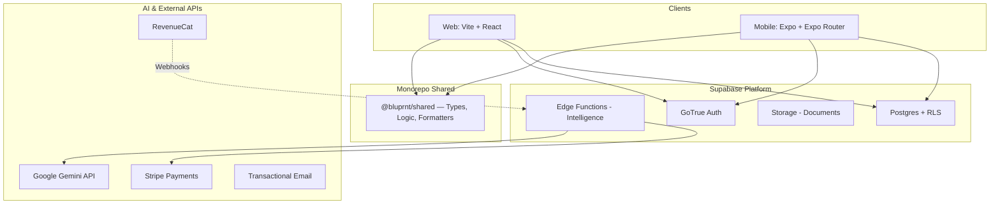

# BLUPRNT.AI (v3)

[](https://github.com/bantoinese83/BLUPRNT.AI/actions)
[](LICENSE)
[](docs/developer_handover.md)
[](CONTRIBUTING.md)

**The homeowner-first financial OS for renovations.**

BLUPRNT.AI is an intelligent project management platform that turns the "black box" of home renovation into a trackable, transparent financial asset. Built on a modern monorepo architecture, it serves both Web and Mobile users with a shared intelligence engine.

---

## ✨ Renovation Intelligence (New in v3)

We've moved beyond simple tracking into **Proactive Renovation Partnering**:

- **AI Grounding Engine**: Every estimate is anchored in real-world regional data (RSMeans, HomeAdvisor). We cite our sources directly to build immediate homeowner trust.
- **Reconciliation Engine**: Automated line-item mapping that identifies budget drift (Matched, Under, or Over) the moment a receipt is uploaded.
- **Bulk Document Ingestion**: A sequential background queue that processes dozens of invoices, quotes, and warranties simultaneously via Gemini-powered OCR.
- **Automated "Home Team"**: A dynamic directory of your contractors derived automatically from your ledger, creating a ready-made rolodex for future maintenance or resale.
- **Interactive Transformation Slider**: A curated visual timeline showing your project's evolution from the first "Before" photo to the final "After" hero shot.

---

## 🛠 Tech Stack

| Layer              | Technology                                                  |
| :----------------- | :---------------------------------------------------------- |
| **Web**            | React 19, Vite, Tailwind CSS, TanStack Query, Framer Motion |
| **Mobile**         | React Native, Expo, Expo Router, Moti Animations, Haptics   |
| **Backend**        | Supabase (Postgres, Auth, Storage, Realtime)                |
| **Logic**          | Supabase Edge Functions (Deno 2.x)                          |
| **AI**             | Google Gemini (generateContent API + Vision)                |
| **Payments**       | Stripe (Web) + RevenueCat (Mobile)                          |
| **Infrastructure** | Vercel (Web), EAS (Mobile), Supabase (Backend)              |

---

## 🏗 Architecture

### System Overview

Clients interact with **Supabase** for secure data access via RLS. Privileged intelligence tasks run in **Deno Edge Functions**, ensuring that secrets (Stripe/Gemini keys) never touch the client.



---

## 🚀 Quick Start

### 1. Prerequisites

- Node.js (>= 20.x)
- Supabase CLI (latest)
- Expo Go (for physical mobile testing)

### 2. Environment Setup

Copy the example environment file and fill in your Supabase credentials:

```bash
cp .env.example .env
```

### 3. Installation & Local Development

The project uses **npm workspaces**; run all commands from the root:

```bash
npm install          # Install all dependencies
npm run dev          # Start Web (Vite) on port 3000
npm run dev:mobile   # Start Expo (Mobile) bundler
```

### 4. Quality Gate

Before pushing any changes, ensure the code passes the full verification suite:

```bash
npm run quality      # Lint → Typecheck → Coverage (90%+) → Build
```

---

## 📂 Repository Layout

| Path        | Description                                                              |
| :---------- | :----------------------------------------------------------------------- |
| `web/`      | React 19 SPA. Optimized for 100/100 Lighthouse performance.              |
| `mobile/`   | Expo Native app. Features 'Liquid Glass' navigation and native gestures. |
| `shared/`   | Shared logic, strictly typed database schemas, and formatting utilities. |
| `supabase/` | Database migrations and the Deno Edge Function suite.                    |
| `docs/`     | Deep-dives on API configurations, deployment, and handover notes.        |

---

## 💳 Payments & Tiered Access

BLUPRNT implements a hybrid monetization model:

- **Stripe (Web)**: Managed via `create-checkout` and `stripe-webhook` Edge Functions.
- **RevenueCat (Mobile)**: Native in-app purchases with a dedicated `revenuecat-webhook` for cross-platform entitlement syncing.
- **Tier Enforcement**: Logic is centralized in `@bluprnt/shared` and enforced via `assertProjectOwner` and `checkInvoiceUploadAllowed` in the Edge layer.

---

## 📄 Documentation Links

- [**Production Launch Handbook**](docs/production_launch_handbook.md)
- [**Developer Handover**](docs/developer_handover.md)
- [**Gemini AI Integration**](docs/gemini-api.md)
- [**Mobile Release Guide**](docs/mobile_release_guide.md)

---

**BLUPRNT.AI is a project by Monarch Labs Inc. All rights reserved.**
