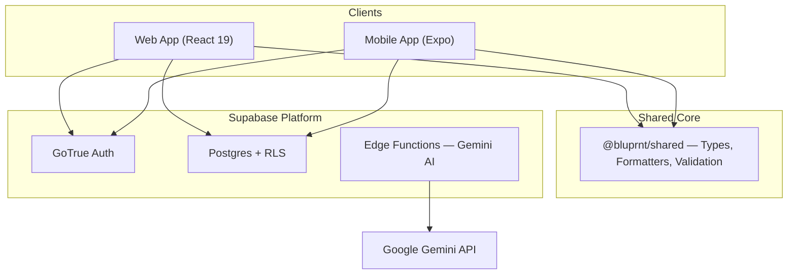

# BLUPRNT.AI (v3)

[](https://github.com/bantoinese83/BLUPRNT.AI/actions)
[](LICENSE)
[](CONTRIBUTING.md#coverage-thresholds)
[](CONTRIBUTING.md)
[](SECURITY.md)

**The homeowner-first financial OS for renovations.**

BLUPRNT.AI is an intelligent project management platform that turns the "black box" of home renovation into a trackable, transparent financial asset. Built on a modern, strictly-typed monorepo, it serves both Web and Mobile users with a shared intelligence engine.

---

## ✨ Renovation Intelligence

We've moved beyond simple tracking into **Proactive Renovation Partnering**:

- **AI Grounding Engine**: Every estimate is anchored in real-world regional data. We cite our sources directly to build immediate homeowner trust.
- **Reconciliation Engine**: Automated line-item mapping that identifies budget drift (Matched, Under, or Over) the moment a receipt is uploaded.
- **Bulk Document Ingestion**: A sequential background queue that processes dozens of invoices, quotes, and warranties simultaneously via Gemini-powered OCR.
- **Interactive Transformation Slider**: A curated visual timeline showing your project's evolution from the first "Before" photo to the final "After" hero shot.

---

## 🏗 Modular Architecture

This project follows a strict **Anti-Monolith** philosophy. Logic is decoupled from presentation to ensure maximum testability and maintainability.

### The Stack

| Layer            | Technology                                                  |
| :--------------- | :---------------------------------------------------------- |
| **Web**          | React 19, Vite, Tailwind CSS, TanStack Query, Framer Motion |
| **Mobile**       | React Native, Expo, Expo Router, Moti Animations, Haptics   |
| **Backend**      | Supabase (Postgres, Auth, Storage, Realtime)                |
| **Intelligence** | Google Gemini 1.5 Pro + Deno Edge Functions                 |
| **Payments**     | Stripe (Web) + RevenueCat (Mobile)                          |

### System Blueprint



---

## 🚀 Quick Start

### 1. Prerequisites

- Node.js (>= 20.x)
- Supabase CLI
- Expo Go

### 2. Installation

```bash
npm install          # Install all workspace dependencies
```

### 3. Local Development

```bash
npm run dev          # Start Web (Vite)
npm run dev:mobile   # Start Expo (Mobile)
```

### 4. The quality gate

We maintain a **zero-warning** ESLint policy on the paths CI checks. Before pushing, your code must pass:

```bash
npm run check        # Lint → Knip → Typecheck → Coverage → Build
```

CI also runs **Playwright** (Chromium and WebKit per `playwright.config.ts`), **Deno typecheck** for Supabase edge functions, optional **Supabase DB types** verification via `npm run db:types:check` (when `SUPABASE_ACCESS_TOKEN` is set), and **Maestro** mobile flows on `main` / PRs (see [.github/workflows/ci.yml](.github/workflows/ci.yml)). Local E2E: `npm run test:e2e` (full), `npm run test:e2e:smoke` (fast subset), `npm run test:e2e:probes` (popup/offline probes only).

### What “10/10” means here

We treat **10/10** as **defensible excellence**: honest docs, automated gates, and security reporting—not vanity badges. Coverage is enforced on **critical subsets** of web/mobile (see [CONTRIBUTING.md — Coverage thresholds](CONTRIBUTING.md#coverage-thresholds)); full-repo line coverage is not claimed.

---

## 📂 Repository Guide

| Path        | Description                                                         |
| :---------- | :------------------------------------------------------------------ |
| `web/`      | React 19 SPA, performance- and accessibility-oriented UX.           |
| `mobile/`   | Expo Native app. Features modular components and native gestures.   |
| `shared/`   | The source of truth for types, database schemas, and billing logic. |
| `supabase/` | Database migrations and the Deno Edge Function suite.               |
| `docs/`     | [**Architecture Deep-Dive**](docs/ARCHITECTURE.md)                  |

---

## 📄 Documentation Links

- [**Engineering Architecture**](docs/ARCHITECTURE.md) — Patterns, performance, and structure.
- [**Contributing Guidelines**](CONTRIBUTING.md) — Quality gate, coverage thresholds, workflow.
- [**Security**](SECURITY.md) — How to report vulnerabilities responsibly.
- [**Production Launch Handbook**](docs/production_launch_handbook.md) — Deployment and ops.
- [**Gemini AI Integration**](docs/gemini-api.md) — How the intelligence layer works.

---

**BLUPRNT.AI is a project by Monarch Labs Inc. All rights reserved.**
