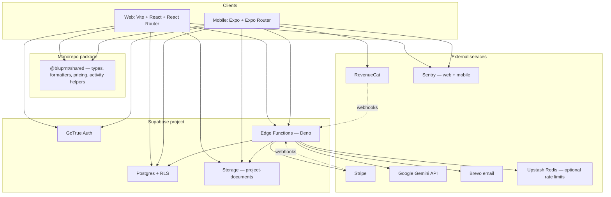

# BLUPRNT.AI (v3)

**The homeowner-first financial OS for renovations.**

Monorepo: **Vite + React** (`web/`), **Expo** (`mobile/`), and **shared TypeScript** (`shared/`) on **Supabase** (Postgres, Auth, Storage) with **Edge Functions** for estimates, invoice OCR, billing, and resale analytics.

## Architecture

### System overview

Clients talk to **Supabase** for authentication, row-level–secured Postgres, and Storage. Heavy or privileged work runs in **Supabase Edge Functions** (Deno): AI estimates, invoice OCR, Stripe/RevenueCat webhooks, email, and rate-limited APIs. **`@bluprnt/shared`** holds types, formatters, pricing, and other modules so web and mobile stay consistent.



### Client applications

| Layer                 | Web (`web/`)                                                        | Mobile (`mobile/`)                                                               |
| --------------------- | ------------------------------------------------------------------- | -------------------------------------------------------------------------------- |
| **UI**                | React 19, Tailwind / design system, lazy route chunks               | React Native, Expo Router file-based routes, Moti animations                     |
| **Routing**           | `react-router-dom` (`BrowserRouter`)                                | `expo-router` (stacks, tabs, modals)                                             |
| **Server state**      | TanStack Query (`QueryClientProvider` in `App.tsx`)                 | TanStack Query (`query-client` + providers in `app/_layout.tsx`)                 |
| **Auth session**      | `AuthProvider` + Supabase JS (`PKCE`, `persistSession`)             | Same Supabase session model; deep links / associated domains for `bluprnt.ai`    |
| **Payments (in-app)** | Stripe Checkout via `functions.invoke('create-checkout', …)`        | **RevenueCat** (`react-native-purchases`) + server sync via `revenuecat-webhook` |
| **Errors / perf**     | Sentry (`src/lib/sentry.ts`, Vite plugin for uploads)               | Sentry RN SDK (`src/lib/sentry.ts`)                                              |
| **Build / deploy**    | Vite → static assets; **Vercel** root `web/` with `shared/` in repo | **EAS Build** / `expo export`; env via `EXPO_PUBLIC_*`                           |

### Backend and data

- **Postgres** is the source of truth for projects, scope, invoices, documents metadata, sharing tokens, and subscription-related rows. Access from clients uses the **anon key** and **RLS**; Edge Functions use the **service role** only where necessary.
- **Storage** holds uploaded PDFs/images (e.g. `project-documents`); Edge helpers issue signed URLs where needed (`get-document-signed-url`).
- **Edge Functions** are the only place for secrets such as `STRIPE_SECRET_KEY`, `GEMINI_API_KEY`, `BREVO_API_KEY`. Clients call them with the user’s JWT (`supabase.functions.invoke`) or they run as webhooks (Stripe, RevenueCat). See the **Edge Functions** table below for JWT/CORS notes.
- **Generated types**: `shared/types/supabase.gen.ts` (and `shared/types/database.ts`) mirror the live schema; regenerate with `npm run db:types` after migrations.

### Request paths (conceptual)

1. **CRUD & reads**: App → Supabase PostgREST (authenticated) → RLS → Postgres.
2. **AI estimate / OCR / chat**: App → Edge Function → Gemini (and optional Google Search grounding for estimates) → writes to Postgres/Storage.
3. **Web billing**: App → `create-checkout` → Stripe Checkout → `stripe-webhook` → updates subscription tables.
4. **Mobile billing**: App → RevenueCat SDK → Apple/Google → RevenueCat servers → `revenuecat-webhook` → `user_subscriptions` / entitlements.

## Repository layout

| Path        | Purpose                                                                                                               |
| ----------- | --------------------------------------------------------------------------------------------------------------------- |
| `web/`      | Production web app (Vite, port **3000** in dev). Imports `@shared/*` → `shared/`.                                     |
| `mobile/`   | Expo Router app; uses the same Supabase project. Imports `@shared/*` → `shared/`.                                     |
| `shared/`   | Package **`@bluprnt/shared`**: shared types, formatters, pricing constants, and other modules used by web and mobile. |
| `supabase/` | Migrations, Edge Functions, local config.                                                                             |

Root **`package.json`** defines npm workspaces. Run installs and most scripts from the **repository root** unless noted.

### Mobile feature modules

Screen-sized flows live under **`mobile/src/features/<name>/`** (for example **`onboarding/`**, **`project-detail/`**). When a folder has an **`index.ts`** barrel, **routes** import from **`@/features/<name>`**; files inside the same feature prefer **relative** imports (`./Component`, `./helpers`) so aliases stay short at boundaries. **`npm run knip`** helps catch unused exports in the web workspace (see [`knip.json`](knip.json)).

## Location (onboarding)

The location step **auto-fills** an approximate area from your network (IP → reverse geocode via [Photon](https://photon.komoot.io/)). **Use precise location** uses the browser GPS API for a tighter ZIP or place name. You can always edit the field.

## Features

- **Regional AI estimates**: Photos or postal code → locally grounded renovation budgets.
- **Invoice OCR and ledger**: Upload receipts to map actual costs against your budget.
- **Resale value impact**: ROI and financial impact of improvements.
- **Seller packet**: Export a PDF of renovation history for agents and buyers.
- **Web app**: SPA deployment; service worker / web app manifest are disabled to avoid stale caches and install prompts.
- **Project lifecycle**: Archive and manage multiple properties or renovation phases.

## Quick start

### 1. Environment

Copy [`.env.example`](.env.example) to **`.env`** at the **repository root**. Vite loads it via `web/vite.config.ts` (`envDir` points to the repo root).

Set at minimum:

- `VITE_SUPABASE_URL` — Project URL (Supabase → Settings → API)
- `VITE_SUPABASE_ANON_KEY` — anon public key
- `VITE_SITE_URL` — e.g. `http://localhost:3000` locally; in production, your **canonical** origin (no trailing slash)

For **mobile**, set `EXPO_PUBLIC_SUPABASE_URL` and `EXPO_PUBLIC_SUPABASE_ANON_KEY` in `mobile/.env`, EAS secrets, or your Expo env workflow — see [`.env.example`](.env.example).

### 2. Auth — Google and magic links

In **Supabase Dashboard → Authentication → URL Configuration**:

- **Site URL**: `https://bluprntai.com` (or your domain)
- **Redirect URLs** (adjust host to your canonical domain):  
  `http://localhost:3000/**`  
  `https://bluprntai.com/**`  
  If you serve **`www`**, add `https://www.bluprntai.com/**` **or** redirect `www` → apex so one hostname is used everywhere.

**Google**: Authentication → **Providers** → **Google** → enable and add **Client ID** and **Client Secret** from [Google Cloud Console](https://console.cloud.google.com/) (OAuth 2.0 Web client). Authorized redirect URI in Google:  
`https://<YOUR_SUPABASE_REF>.supabase.co/auth/v1/callback`  
**Authorized JavaScript origins** must include the exact origin users load the app from (e.g. `https://bluprntai.com` and `https://www.bluprntai.com` if both exist).

**Magic links**: Email provider must be on. The app sends OTP sign-in and signup links to **`/auth/callback`**.

### 3. Auth (password / onboarding)

For email+password signup during onboarding, either turn **off** “Confirm email” under **Email**, or confirm email before the app can save your project in one step.

### 4. Install and run

```bash
npm install
npm run dev          # web — http://localhost:3000
npm run dev:mobile   # Expo (from root)
```

**Quality gate (recommended before pushing):**

```bash
npm run check        # lint (incl. design-token parity) → knip → tests w/ coverage → production build
```

## Vercel (web)

1. **Root Directory**: set to **`web`** (this matches [`web/vercel.json`](web/vercel.json) for headers and SPA rewrites).
2. **Include files outside the root directory**: enable so the build can resolve **`shared/`** (import alias `@shared` in `web/vite.config.ts`).
3. **Environment variables**: add the same `VITE_*` (and any other) variables your web app needs; they are read at build time for Vite.
4. **Install**: Vercel runs `npm install` for the deployment. The root `prepare` script **skips Husky** when `VERCEL` or `CI` is set, so installs do not fail on missing `husky` in production-only installs.

If the build cannot resolve `@shared`, confirm the setting above and that the full repo is checked out (not only the `web` folder without `shared`).

## Mobile (Expo)

From the repo root:

```bash
npm run dev:mobile
```

Use **EAS** and project env for store builds; see [`.env.example`](.env.example) for `EXPO_PUBLIC_*` and RevenueCat keys. CI for mobile builds may use root `npm ci` and the single root lockfile — see [`.github/workflows/`](.github/workflows/) if present.

**Path aliases** ([`mobile/tsconfig.json`](mobile/tsconfig.json)): `@/*` → `mobile/src/*`, `@shared/*` → repo `shared/*`, `@app/*` → `mobile/app/*`, `@assets/*` → `mobile/assets/*`. Enable Metro resolution with **`experiments.tsconfigPaths`: true** in [`mobile/app.json`](mobile/app.json). Vitest mirrors these in [`mobile/vitest.config.ts`](mobile/vitest.config.ts). Optional maintenance: [`scripts/rewrite-mobile-imports.mjs`](scripts/rewrite-mobile-imports.mjs) rewrites relative imports to aliases.

## Stripe (paid plans)

BLUPRNT.AI uses dynamic Stripe Checkout via Supabase Edge Functions.

1. Create products in Stripe (Architect monthly and Project Pass).
2. Add to `.env` (see [`.env.example`](.env.example)):

   ```env
   VITE_STRIPE_ARCHITECT_PRICE_ID=price_1...
   VITE_STRIPE_PROJECT_PASS_PRICE_ID=price_1...
   ```

3. **Supabase secrets**: set **`STRIPE_SECRET_KEY`** and **`STRIPE_WEBHOOK_SECRET`**. Checkout mode (subscription vs one-time) is inferred from each Stripe Price via the API; **`STRIPE_ARCHITECT_PRICE_ID` on Edge is optional** (legacy override only).

4. Display copy and plan metadata for the app should stay aligned with Stripe — see [`shared/constants/pricing.ts`](shared/constants/pricing.ts).

### Plans and invoice upload limits

Enforcement for **invoice** uploads is in [`supabase/functions/_shared/entitlements.ts`](supabase/functions/_shared/entitlements.ts):

- **Free**: up to **3** invoice documents per **project** (quotes, warranties, permits, and other types do not count).
- **Architect** (active subscription): **10** invoice uploads per **billing period**, **account-wide** (counter aligns with Stripe `current_period_end`).
- **Project Pass**: unlimited invoice uploads for **that project** while the pass is valid.

Public **iOS App Store** URL for in-app and marketing links: [`shared/constants/app-links.ts`](shared/constants/app-links.ts) (`IOS_APP_STORE_URL`).

5. **Deploy** `create-checkout` with gateway JWT off (matches [`supabase/config.toml`](supabase/config.toml)) so the client is not blocked by edge `Invalid JWT` before your code runs; auth is still enforced inside the function.

   ```bash
   npx supabase functions deploy create-checkout --project-ref YOUR_PROJECT_REF --no-verify-jwt
   npx supabase functions deploy stripe-webhook --project-ref YOUR_PROJECT_REF --no-verify-jwt
   ```

   Or use root scripts such as `npm run functions:deploy:checkout` and `npm run functions:deploy:stripe-webhook` (project ref is set in root `package.json` — override with your ref as needed).

## Edge Functions

| Function                  | JWT verify at gateway | Purpose                                                                                         |
| ------------------------- | --------------------- | ----------------------------------------------------------------------------------------------- |
| `create-checkout`         | Off\*                 | Stripe Checkout session (user validated in-function)                                            |
| `stripe-webhook`          | Off                   | Stripe events → provisioning                                                                    |
| `revenuecat-webhook`      | Off                   | RevenueCat events → `user_subscriptions`                                                        |
| `photo-to-scope`          | Off\*                 | Estimate from ZIP, room type, optional photos (Gemini + optional Google Search grounding)       |
| `upload-invoice`          | Off\*                 | Upload PDF/image → Storage + `documents` + `invoices` (Gemini OCR when `GEMINI_API_KEY` is set) |
| `get-invoice`             | Off\*                 | Load invoice and line items                                                                     |
| `get-document-signed-url` | Off\*                 | Signed URL for project documents                                                                |
| `get-project-view`        | Off                   | Public: project + scope by share token                                                          |
| `delete-account`          | Off\*                 | Delete user data, Storage, Stripe cleanup when configured, then auth user                       |
| `send-email`              | Off\*                 | Transactional email (e.g. Brevo)                                                                |
| `submit-marketing-lead`   | Off\*                 | Marketing lead capture                                                                          |
| `chat-with-project`       | Off\*                 | Project-scoped chat / AI                                                                        |

\*Gateway JWT verification is off in [`supabase/config.toml`](supabase/config.toml) for these routes so requests reach the Deno handler without spurious `Invalid JWT`. Handlers that require a signed-in user validate the `Authorization` bearer token inside the function.

### Deploy (examples)

```bash
npx supabase login
npx supabase functions deploy photo-to-scope --project-ref YOUR_PROJECT_REF --no-verify-jwt
npx supabase functions deploy create-checkout --project-ref YOUR_PROJECT_REF --no-verify-jwt
npx supabase functions deploy upload-invoice get-invoice --project-ref YOUR_PROJECT_REF --no-verify-jwt
npx supabase functions deploy get-project-view --project-ref YOUR_PROJECT_REF --no-verify-jwt
```

Edge runtime receives `SUPABASE_URL`, `SUPABASE_ANON_KEY`, and `SUPABASE_SERVICE_ROLE_KEY` automatically.

### Edge secrets (optional)

Set in Supabase Dashboard → Project Settings → Edge Functions → Secrets:

| Secret                      | Description                                                         |
| --------------------------- | ------------------------------------------------------------------- |
| `ALLOWED_ORIGINS`           | Comma-separated origins for CORS. If unset, allows `*`.             |
| `RATE_LIMIT_REQUESTS`       | Max requests per window (default: 60)                               |
| `RATE_LIMIT_WINDOW_MS`      | Window in ms (default: 60000)                                       |
| `STRIPE_SECRET_KEY`         | Stripe secret: webhook, checkout, `delete-account` cleanup          |
| `STRIPE_WEBHOOK_SECRET`     | Stripe webhook signing secret                                       |
| `STRIPE_ARCHITECT_PRICE_ID` | Optional on Edge; forces subscription mode if set                   |
| `GEMINI_API_KEY`            | Gemini for invoice OCR and `photo-to-scope` (never in Vite env)     |
| `GEMINI_MODEL`              | Optional model id (default `gemini-2.5-flash`)                      |
| `BREVO_API_KEY`             | Brevo / `send-email`                                                |
| `UPSTASH_REDIS_REST_URL`    | Optional; with token, shared rate limits in `_shared/rate-limit.ts` |
| `UPSTASH_REDIS_REST_TOKEN`  | Optional; Upstash REST token                                        |

#### Gemini API (Edge)

Estimator and invoice parsing use the **Gemini REST** `generateContent` API. Maintainer reference: **[docs/gemini-api.md](docs/gemini-api.md)**.

- [Models](https://ai.google.dev/gemini-api/docs/models)
- [Text generation](https://ai.google.dev/gemini-api/docs/text-generation)
- [Tools](https://ai.google.dev/gemini-api/docs/tools)
- [Grounding with Google Search](https://ai.google.dev/gemini-api/docs/google-search) — used for local market–aware estimates in `photo-to-scope`

Shared client: `supabase/functions/_shared/gemini.ts` (`callGemini`).

## Database

Core tables include: `properties`, `projects`, `scope_items`, `documents`, `invoices`, `invoice_line_items`, `project_view_tokens`, `seller_packets`, `user_preferences`, plus Storage bucket `project-documents`.

**Migrations** live in [`supabase/migrations/`](supabase/migrations/) as a **single consolidated file** (`20260420100000_consolidated_schema.sql`) that replaces the previous incremental chain. New environments apply it with `supabase db reset` (local) or `supabase db push` (empty project).

**Already-deployed Supabase projects** that recorded the old migration versions must **not** run that SQL again. After pulling this repo, align history once:

```bash
supabase link --project-ref <your-project-ref>
supabase migration repair --linked --status reverted \
  20260318000000 20260318100000 20260318110000 20260318120000 \
  20260324100000 20260324110000 20260402120000 20260402130000 \
  20260402140000 20260402150000 20260402160000 20260406134430 \
  20260406194620 20260407150000 20260408210000 20260409120000 \
  20260410000000 20260410010000 20260412132118 20260412150000 \
  20260415160000 20260416103000
supabase migration repair --linked --status applied 20260420100000
```

That marks the old rows removed and the consolidated migration as applied without re-executing DDL. Use the Dashboard SQL editor backup/export first if you are unsure.

**Generate TypeScript types** after schema changes (output is committed as **`shared/types/supabase.gen.ts`**; the generator script path is defined in [`scripts/gen-db-types.sh`](scripts/gen-db-types.sh); requires `SUPABASE_ACCESS_TOKEN` and uses `SUPABASE_PROJECT_ID` if set):

```bash
npm run db:types
npm run db:types:check   # CI-friendly: fail if generated file drifts
```

### Observability and scaling

- **Edge logs**: JSON lines via `console` (`_shared/log.ts`).
- **Client crashes**: The web app `ErrorBoundary` logs a single JSON line with a random `eventId` for support.
- **Rate limits**: Default in-memory per isolate (`_shared/rate-limit.ts`). For stricter or multi-instance limits, add **Upstash Redis**, **gateway limits**, or a **shared DB counter** — see comments in that file.

### Schema overview

| Table                 | Purpose                                                        |
| --------------------- | -------------------------------------------------------------- |
| `properties`          | Address, postal code, location fields; `owner_user_id`         |
| `projects`            | `property_id`, name, room type, stage, estimates, confidence   |
| `scope_items`         | Line items: category, costs, optional AI detail / verification |
| `documents`           | `project_id`, type, storage path, filename                     |
| `invoices`            | Vendor, totals, payment and OCR status                         |
| `invoice_line_items`  | Lines; optional `scope_item_id` mapping                        |
| `project_view_tokens` | Share links: `project_id`, token, `expires_at`                 |
| `seller_packets`      | Generated packet metadata and storage path                     |
| `user_subscriptions`  | Architect plan / Stripe subscription fields                    |
| `project_passes`      | One-time pass per project, expiry                              |
| `user_preferences`    | Per-user preferences (e.g. mobile push token)                  |

## Scripts (root)

All commands run from the **repository root** unless you use `npm run <script> -w web` explicitly.

| Script                                         | Description                                                                                                                 |
| ---------------------------------------------- | --------------------------------------------------------------------------------------------------------------------------- |
| `npm run dev` / `dev:web`                      | Vite dev server (`web`, port 3000)                                                                                          |
| `npm run dev:mobile`                           | Expo (`mobile`)                                                                                                             |
| `npm run build`                                | `vite build` (`web`) + `expo export` iOS & Android JS bundles (`mobile`; no Xcode/Android SDK)                              |
| `npm run build:web` / `build:mobile`           | Build only `web` or only `mobile`                                                                                           |
| `npm run preview`                              | Preview production build locally                                                                                            |
| `npm run clean`                                | Remove `web/dist`                                                                                                           |
| `npm run lint`                                 | ESLint + `tsc` for `web` and `mobile`                                                                                       |
| `npm run typecheck`                            | Typecheck `web` and `mobile`                                                                                                |
| `npm run test`                                 | Vitest watch (`web`)                                                                                                        |
| `npm run test:run`                             | Vitest once — **`web` then `mobile`**                                                                                       |
| `npm run test:coverage`                        | Vitest coverage — **`web`** (lib/hooks/services) **+ `mobile`** (tested `src/lib` modules); see `vitest.config` in each app |
| `npm run test:ui`                              | Vitest UI (`web`)                                                                                                           |
| `npm run test:e2e`                             | Playwright — web app (`playwright.config.ts` at repo root; runs in CI)                                                      |
| `npm run test:e2e:mobile`                      | Maestro smoke — Expo app ([`scripts/e2e-mobile-maestro.sh`](scripts/e2e-mobile-maestro.sh); local only — see below)         |
| `npm run knip` / `knip:mobile` / `knip:shared` | Unused-code analysis per workspace (see root [`knip.json`](knip.json))                                                      |
| `npm run knip:check`                           | Runs Knip for root config + `mobile` + `shared`                                                                             |
| `npm run check`                                | `lint` + `knip:check` + `test:coverage` + `build`                                                                           |
| `npm run test:all`                             | `check` + `test:coverage` + `test:e2e`                                                                                      |
| `npm run db:types`                             | Regenerate Supabase TS types (`scripts/gen-db-types.sh`)                                                                    |
| `npm run db:types:check`                       | Verify generated types match (`scripts/check-db-types.sh`)                                                                  |
| `npm run format`                               | Prettier for web, mobile, shared sources                                                                                    |
| `npm run functions:check`                      | Validate Edge Function layout (`scripts/check-edge-functions.sh`)                                                           |
| `npm run postdeploy:verify`                    | Post-deploy smoke script (`scripts/post-deploy-verify.sh`)                                                                  |
| `npm run functions:deploy:photo`               | Deploy `photo-to-scope`                                                                                                     |
| `npm run functions:deploy:invoices`            | Deploy `upload-invoice`, `get-invoice`                                                                                      |
| `npm run functions:deploy:project-view`        | Deploy `get-project-view`                                                                                                   |
| `npm run functions:deploy:checkout`            | Deploy `create-checkout`                                                                                                    |
| `npm run functions:deploy:stripe-webhook`      | Deploy `stripe-webhook`                                                                                                     |
| `npm run functions:deploy:revenuecat-webhook`  | Deploy `revenuecat-webhook`                                                                                                 |
| `npm run functions:deploy:delete-account`      | Deploy `delete-account`                                                                                                     |
| `npm run functions:deploy:send-email`          | Deploy `send-email`                                                                                                         |
| `npm run functions:deploy:marketing-lead`      | Deploy `submit-marketing-lead`                                                                                              |
| `npm run functions:deploy:chat`                | Deploy `chat-with-project`                                                                                                  |
| `npm run functions:deploy`                     | Deploy all Edge Functions via Supabase CLI (project ref in root `package.json`)                                             |
| `npm run functions:deploy:rate-limited`        | Batch deploy of rate-limited / public surface                                                                               |

### End-to-end tests

- **Web**: `npm run test:e2e` starts a production preview and runs Playwright under [`e2e/`](e2e/). The web server injects minimal `VITE_*` defaults when unset so builds work in CI without a root `.env`.
- **Mobile**: `npm run test:e2e:mobile` runs [`mobile/maestro/app-smoke.yaml`](mobile/maestro/app-smoke.yaml). You need the [Maestro CLI](https://docs.maestro.dev/maestro-cli/how-to-install-maestro-cli), an iOS Simulator or Android emulator, and the **dev client** installed for bundle id `ai.bluprnt.mobile` (for example `npx expo run:ios` or `run:android` from `mobile/`). This is **not** part of the default Ubuntu CI job; add a separate **macOS** workflow with Xcode if you want Maestro in CI.

---

**Troubleshooting:** If `functions.invoke` fails, confirm functions are deployed, CORS allows your origin, and the anon key matches the Supabase project.
