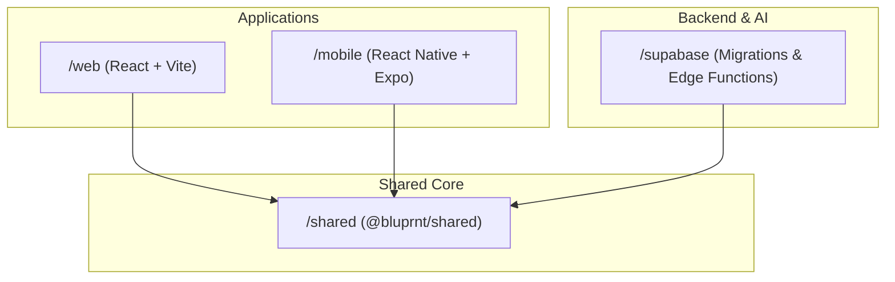

# Engineering Architecture & Design Patterns

This document outlines the technical philosophy and structural decisions behind BLUPRNT.AI. It is intended for senior engineers and architects maintaining or extending the platform.

## 1. Core Principles

### No "God Files" (Strict Modularization)

We adhere to a strict policy against monolithic components or hooks. Files exceeding 400-500 lines are candidates for refactoring.

- **UI vs Logic**: Logic is extracted into specialized hooks (e.g., `useDashboardHandlers.ts`).
- **Composition**: Screens are orchestrators of smaller, focused components (e.g., `EstimateHeader.tsx`, `InvestmentRangeCard.tsx`).
- **Single Responsibility**: Each component should do one thing and do it with "WOW" factor.

### Total Type Safety

The repository is configured with `strict: true` and zero-tolerance for `any`.

- **Shared Schemas**: All database-linked types are centralized in `@bluprnt/shared` and derived directly from Supabase generated types where possible.
- **Import Type**: Use `import type` for all type-only imports to optimize build performance and prevent circular dependencies.

### Performance as a Feature

- **Elimination of N+1 Queries**: We use Supabase Resource Embedding (Join queries) to fetch related data in a single round-trip.
- **Optimized Rendering**: `React.memo` and `useCallback` are used strategically for high-frequency interaction points like budget adjustment sliders.
- **Core Web Vitals**: The web app targets strong LCP and minimal CLS; exact Lighthouse scores vary by route, auth state, and third-party scripts—CI enforces correctness and builds, not a single lab score on every page.

## 2. Monorepo Structure

We use **NPM Workspaces** to manage the ecosystem:



### @bluprnt/shared

This package contains the "Source of Truth" for:

- **Constants**: Pricing, regional cost multipliers, and feature flags.
- **Formatters**: Currency, date, and project-specific formatting (e.g., Bill of Materials normalization).
- **Validation**: Zod schemas for client-side and Edge Function validation.

## 3. Data Flow & State Management

### Server State (TanStack Query)

We use TanStack Query for almost all asynchronous state.

- **Polling**: Critical for the Project Detail screen to show live budget updates as AI processes receipts in the background.
- **Optimistic Updates**: Implemented for high-interaction tasks (e.g., renaming a project) to provide instant UI feedback.

### Persistence (RLS & GoTrue)

Supabase Row Level Security (RLS) is the bedrock of our security model.

- **Privacy First**: Every table has a `user_id` or `project_id` policy ensuring users can only see their own renovation data.
- **Identity**: Centralized Auth via GoTrue, shared between Web (cookies) and Mobile (JWT).

## 4. AI & Intelligence Layer

The "Renovation Intelligence" engine runs on **Google Gemini** via Supabase Edge Functions.

- **Grounding**: AI estimates are grounded in real-world pricing data passed in the prompt context.
- **Sequential Ingestion**: Receipts are processed via a Deno-based background queue to prevent UI blocking during bulk uploads.

## 5. Quality Standards (The 100/100 Check)

A "Pass" is only granted when the following four gates are cleared simultaneously:

1. **Linting**: 0 warnings in ESLint.
2. **Knip**: 0 unused files, exports, or dependencies.
3. **Typecheck**: 0 `tsc` errors across all workspaces.
4. **Build**: Successful production bundles for both Web and Mobile.

Run the gatekeeper via:

```bash
npm run check
```

---

_Document Version: 3.1 (Post-Modular Refactor)_
